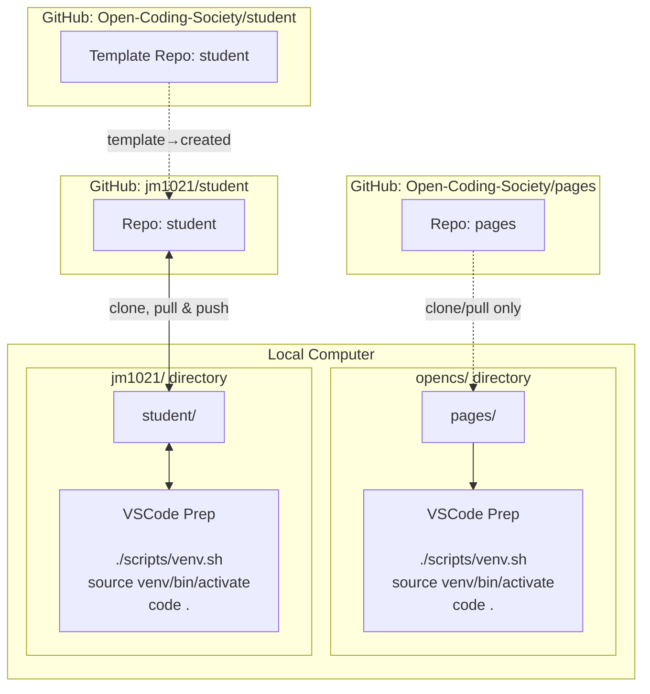

## Visual Journey

Linux is the most compatible OS for Developers.  

This visual help remind me of Tools and their relationship to my Development Journey. 

## What I Learned
This week I learned how GitHub connects my local computer to the website.  
At first it felt confusing, but I realized each tool has a purpose:
- GitHub stores my code online
- my laptop stores and runs the local version
- VSCode helps me edit
- git commands move my work between the two

## Reflection
The hardest part was fixing errors, especially 404 pages.  
But I started to understand how permalinks work and why pushing to GitHub matters.

## My Goal
My next goal is to make my site look cleaner. 